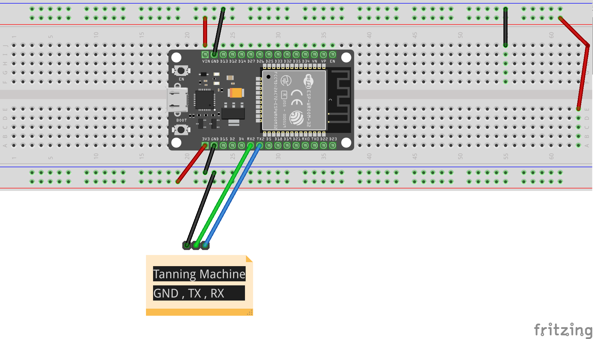
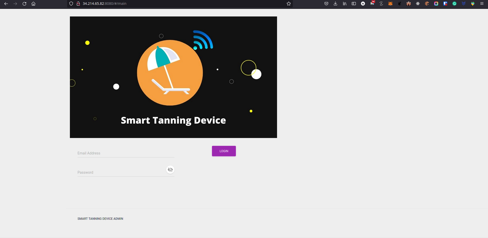
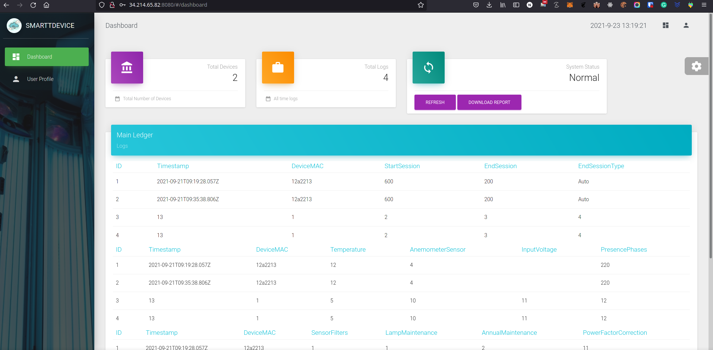
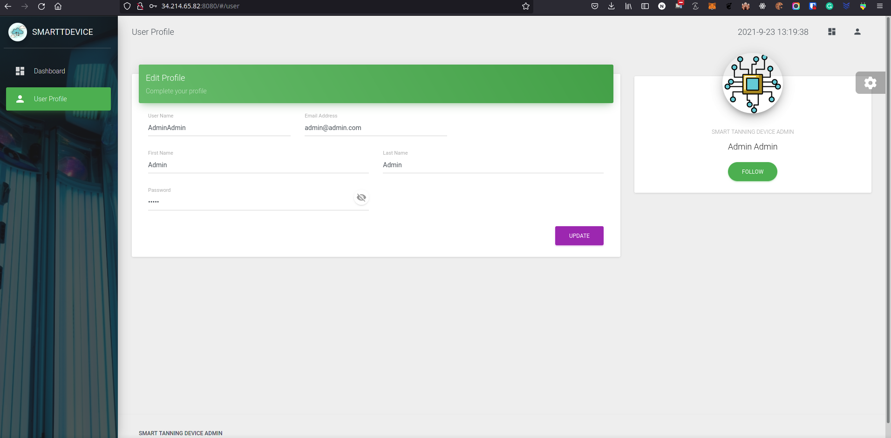
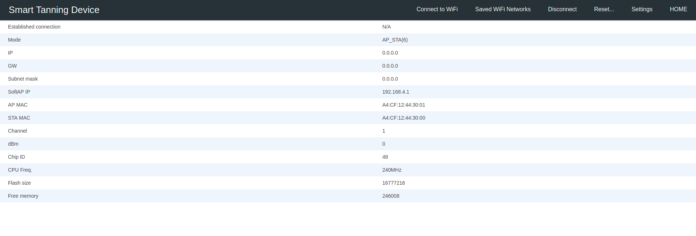

<p align="center">
  <a href="" rel="noopener">
 </a>
</p>

<h3 align="center">Smart Tanning Device</h3>

<div align="center">

[]()


</div>

---


<p align="center"> Smart Tanning Device
    <br> 
</p>

## 📝 Table of Contents

- [About](#about)
- [Getting Started](#getting_started)
- [Circuit](#circuit)
- [Server Details](#server)
- [MQTT Topic Details](#mqtt)
- [API Details](#api)
- [Usage](#usage)
- [List Of Components](#list)
- [Built Using](#built_using)
- [Authors](#authors)


## 🧐 About <a name = "about"></a>

This repo contains

- Backend
- Firmware
- Client auto-Installer script
- Detailed instructions

for Smart Tanning Device.


## Getting Started <a name = "getting_started"></a>

These instructions will get you a copy of the project up and running on your system.

### Prerequisites

Things you need to install the FW.

```
- Arduino IDE
```

### Installing <a name = "installing"></a>

A step by step series that tell you how to get the Firmware and Backend running

#### ESP32 Configuration

You should have Arduino IDE Installed

  1.  Add ESP32 Board to your Arduino IDE
    1. In your Arduino IDE, go to File> Preferences
        Installing ESP32 Add-on in Arduino IDE Windows, Mac OS X, Linux open preferences
    2. Enter ```https://dl.espressif.com/dl/package_esp32_index.json``` 
        into the “Additional Board Manager URLs” field then, click the “OK” button:
        Note: if you already have the ESP32 boards URL, you can separate the URLs with a comma(each board will go to neaw line) as follows:
        ```https://dl.espressif.com/dl/package_esp32_index.json,\n http://arduino.esp8266.com/stable/package_esp8266com_index.json```
    
    
  2. Open the Boards Manager. Go to Tools > Board > Boards Manager…
  3. Search for ESP32 and press install button for the ESP32 by Espressif Systems“:
  4. That’s it. It should be installed after a few seconds.
  5.   In your Arduino sketchbook directory, create tools directory if it doesn't exist yet.
  6.  Unpack the tool into tools directory(present in libs/ESP32FS-1.0.zip) (the path will look like <home_dir>/Arduino/tools/ESP32FS/tool/esp32fs.jar).
  7.  Close and re-open the Arduino IDE.

  8.  Now copy the contents of the libs folder to the libraries directory of your Arduino
      1. If you are using windows, the libraries directory will be Documents/Arduino/libraries

##### ESP32 Node FW Uploading
  1.  Select ESP32 Dev Module from Tools->Board->ESP32
  2.  Select the correct port from Tools->Port
  3.  Then open Firmware.ino file,
  4.  Select Tools > ESP32 Sketch Data Upload menu item. This should start uploading the files into ESP32 flash file system.
  5.  Now Upload the Code to your ESP32 Dev Module.
  6.  Your ESP32 is now ready to be used.


## Circuit <a name = "circuit"></a>


### ESP32 Dev Module Pinout


Follow the pinout diagram given below to connect different components to your TTGO LORA32 board.


### Complete Circuit Diagram

Here's the complete circuit diagram of the system.




## Server Details <a name = "server"></a>

### Monitoring

- pm2 list
- pm2 monit

### List of Packages installed on server

- Mosquitto Broker
- NodeJS, NPM, Node, NVM
- PM2
- ufw
- mongod
- mongo-express
### Version Details

- Node v12.16.1
- NPM v6.13.4

### Server Links <a name = "srv"></a>

- MQTT Broker Link: 34.214.65.82:1883
- Backend Link: 34.214.65.82:3000
- Frontend Link: http://34.214.65.82:8080

### Backend

- Backend is based on NodeJS and it is being managed by PM2. It starts automatically on server start.

## MQTT Topic Details <a name = "mqtt"></a>
### Topics List
#### Logs
1.  <span style="color: green">tanning-device/logs</span> `(all log messages are published to this topic) READ-ONLY`

#### Fimrware

2.  <span style="color: green">tanning-device/deviceExists</span> `(Publish DeviceMAC on this topic to check if device exisits in DB) WRITE-ONLY`
    1.  <span style="color: green">tanning-device/deviceExistance</span> `(Response from the above command {null or device MAC}) READ-ONLY`
3.  
4.   <span style="color: green">tanning-device/createNew</span> `(Publish data to create a new device in DB.) WRITE-ONLY`
    - Data Format: DeviceMAC;StartSession;EndSession;EndSessionType;Temperature;SensorFilters;LampMaintenance;AnnualMaintenance;PowerFactorCorrection;AnemometerSensor;InputVoltage;PresencePhases;Timestamp
5.  <span style="color: green">tanning-device/updateDevice</span> `(Publish data to update a device in DB based on its MAC Address.) WRITE-ONLY`
    - Data Format: DeviceMAC;StartSession;EndSession;EndSessionType;Temperature;SensorFilters;LampMaintenance;AnnualMaintenance;PowerFactorCorrection;AnemometerSensor;


## API Details <a name = "api"></a>


### Admin Login

```http
POST http://34.214.65.82:8080/v1/loginAdmin
```

| Parameter | Type | Description | 
| :--- | :--- | :--- |
| `Email` | `string` | **Required**.  *Email address of the admin*|
| `Password` | `string` | **Required**.  *Password of the admin*|

### Update Admin

```http
POST http://34.214.65.82:8080/v1/updateAdmin
```

| Parameter | Type | Description | 
| :--- | :--- | :--- |
| `Email` | `string` | **Required**.  *Email address of the admin*|
| `Password` | `string` | **Required**.  *Password of the admin*|

### List Admins

```http
GET http://34.214.65.82:8080/v1/listAll
```

| Parameter | Type | Description | 
| :--- | :--- | :--- |
```nothing```

### Ledger Log

```http
POST http://34.214.65.82:8080/v1/ledgerLog
```

| Parameter | Type | Description | 
| :--- | :--- | :--- |
```nothing```

### Add New Device

```http
POST http://34.214.65.82:8080/v1/addNewDevice
```

| Parameter | Type | Description | 
| :--- | :--- | :--- |
| `DeviceMAC` | `string` | **Required**.  *Email address of the Device*|
| `StartSession` | `string` | **Required**.  *StartSession of the Device*|
| `EndSession` | `string` | **Required**.  *EndSession of the Device*|
| `EndSessionType` | `string` | **Required**.  *EndSessionType of the Device*|
| `Temperature` | `string` | **Required**.  *Temperature of the Device*|
| `SensorFilters` | `string` | **Required**.  *SensorFilters of the Device*|
| `LampMaintenance` | `string` | **Required**.  *LampMaintenance of the Device*|
| `AnnualMaintenance` | `string` | **Required**.  *AnnualMaintenance of the Device*|
| `PowerFactorCorrection` | `string` | **Required**.  *PowerFactorCorrection of the Device*|
| `AnemometerSensor` | `string` | **Required**.  *AnemometerSensor of the Device*|
| `InputVoltage` | `string` | **Required**.  *InputVoltage of the Device*|
| `PresencePhases` | `string` | **Required**.  *PresencePhases of the Device*|
| `Timestamp` | `string` | **NOT Required**.  *Timestamp of the Device*|


### Responses

Many API endpoints return the JSON representation of the resources created or edited. However, if an invalid request is submitted, or some other error occurs, Gophish returns a JSON response in the following format:

```javascript
{
  "status"  : int,
  "message" : string
}
```
The `message` attribute contains a message commonly used to indicate errors or to return the logged status/

The `status` attribute describes if the transaction was successful or not.


### Status Codes

IoTManagementSystem Backend returns the following status codes in its API:

| Status Code | Description |
| :--- | :--- |
| 200 | `OK` |
| 201 | `CREATED` |
| 400 | `BAD REQUEST` |
| 404 | `NOT FOUND` |
| 500 | `INTERNAL SERVER ERROR` |

## Usage <a name = "usage"></a>

1.  Upload the code to your ESP32.
2.  Connect the ESP32 with your Tanning Machine.
3.  Open the dashboard to monitor the parameters.
    1.  Dashboard Default credentials
        1.  Email Address: **admin@admin.com**
        2.  Password: **admin**

Dashboard Login Page
Dashboard Home Page
Dashboard Profile Page
4.  You can also download the logs in CSV format from the dashboard home page.
5.  Power on your ESP32, it will present you with an AP named ```TanningD-abc``` (while ```TanningD``` can be changed in the portal and ```abc``` is a unique id for each esp32)
6.  Default captive portal password `123456789AP` which can be changed in captive portal.
7.  Connect to the ESP32 access point and open the web-browser and navigate to the link ```http://esp32.local/_ac```. This link will work on most of the operating systems but if your operating system is not allowing to open it, you may want to check the captive portal IP Address from the serial monitor and can use that IP address inplace of the above mentioned URL.
8.  The default access IP Address is ```http://192.168.4.1/_ac```
9.  You will be presented with a main dashboard as shown below(based on your device)
   

5.  Once connected to a WiFi network, you can again access the captive portal using same URL or the IP Address from the Serial monitor.
6.  The data is published to the MQTT Topic ```TanningD/{hostname}``` while the hostname is the one which you can define in Settings page of the captive portal.
7.  You can open settings page with following default credentials
    1.  User: **AP Name (TanningD)**
    2.  Password: **admin**

## List of Components <a name = "list"></a>

Following components are used to make this project

1.  ESP32 Dev Kit Module
https://www.amazon.com/HiLetgo-ESP-WROOM-32-Development-Microcontroller-Integrated/dp/B0718T232Z/ref=sr_1_3?crid=5EOAXOANUSCU&dchild=1&keywords=esp32+nodemcu&qid=1629587138&sprefix=esp32+node%2Caps%2C201&sr=8-3


## ⛏️ Built Using <a name = "built_using"></a>

- [NodeJS](https://nodejs.org/en/) - JS Framework for Backend Programming
- [Eclipse Paho MQTT](https://www.eclipse.org/paho/index.php?page=clients/python/index.php) - MQTT Client for Backend and RPiClient Software
- [Arduino](https://www.arduino.cc/) - Embedded Framework and IDE - For Sensor Node Design
- [VueJS](https://vuejs.org/) - For Dashboard Design


## ✍️ Authors <a name = "authors"></a>

- [@Nauman3S](https://github.com/Nauman3S) - Development and Deployment
